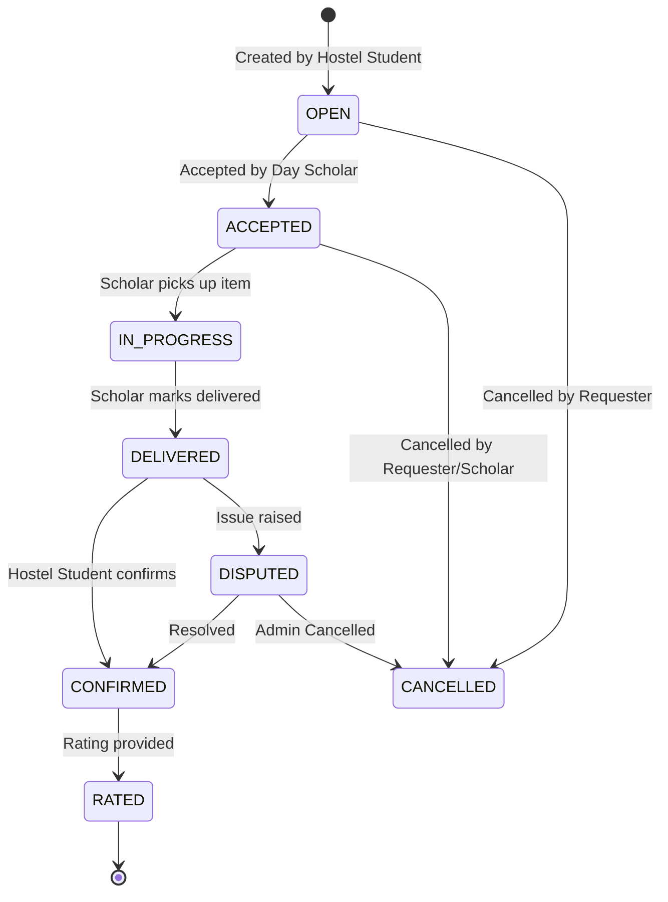

# CampusConnect

CampusConnect is a full-stack, mobile-responsive campus assistance web platform designed exclusively for college communities. It bridges the gap between hostel students (who need items or services from outside the campus) and day scholars (who commute daily and can fulfill small requests). 

It is built as a trust-based coordination tool for a closed college community — **not** a delivery business or payments platform.

## Tech Stack
- **Backend**: Java 21, Spring Boot 3.3, Spring Security (JWT auth via Google OAuth 2.0), Spring Data JPA
- **Database**: PostgreSQL (Production) / H2 In-Memory (Local Dev)
- **Frontend**: React + TypeScript, Vite, Tailwind CSS v4, React Router
- **Realtime**: WebSocket (STOMP over SockJS) for request-scoped chat channels

## Non-Goals & Disclaimers ⚠️
Please note the following explicit limitations of this platform:
- **No Payment Handling**: This platform does not process transactions, hold funds, or enforce payment for items. It is purely for coordination.
- **No Live GPS Tracking**: Request statuses are updated manually via the state machine (Accepted → In Progress → Delivered). There is no geolocation tracking.
- **No Liability Guarantee**: The platform facilitates connections but assumes no liability for lost, damaged, or undelivered items.
- **Not for Medical Emergencies**: While there is an "Emergency" tag, this tool is **not** a substitute for real medical emergency services or official campus medical staff.

## Request State Machine
Requests follow a strict, centralized state machine to ensure valid transitions.



## Prerequisites
- **Local Dev**: JDK 21+, Node.js 20+
- **Dockerized**: Docker and Docker Compose
- **Google OAuth 2.0**: A valid Google OAuth Client ID

## Google OAuth 2.0 Setup
1. Go to the [Google Cloud Console](https://console.cloud.google.com/).
2. Create a new project or select an existing one.
3. Navigate to **APIs & Services > Credentials**.
4. Click **Create Credentials** > **OAuth client ID**.
5. Choose **Web application**.
6. Set **Authorized JavaScript origins** to your frontend URL (e.g., `http://localhost:5173` or `http://localhost`).
7. Copy the generated **Client ID**.

## Setup Instructions

### Environment Variables
Copy the `.env.example` file to `.env` and fill in your values:
```bash
cp .env.example .env
```
Ensure you paste your Google Client ID into the `.env` file.

### Option A: Local Development (H2 In-Memory DB)
This runs the backend standalone without requiring Postgres.
1. **Start Backend**:
   ```bash
   cd backend
   export JAVA_HOME="/path/to/jdk-21"
   ./mvnw clean compile spring-boot:run
   ```
2. **Start Frontend**:
   ```bash
   cd frontend
   npm install
   npm run dev
   ```
3. Visit `http://localhost:5173` in your browser.

### Option B: Production via Docker Compose
This spins up the Postgres database, a slim JRE backend container, and an Nginx frontend container.
1. Ensure `.env` is fully populated.
2. Build and start the stack:
   ```bash
   docker compose up --build -d
   ```
3. Visit `http://localhost` (or `http://localhost:5173`) in your browser.
4. To view logs:
   ```bash
   docker compose logs -f
   ```
5. To tear down:
   ```bash
   docker compose down -v
   ```
